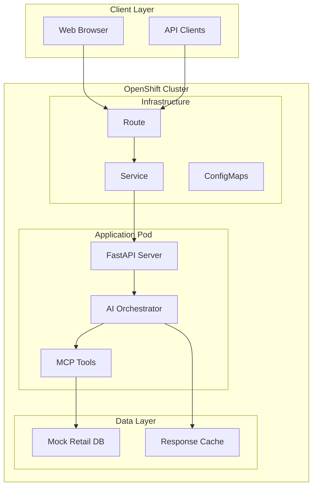

# Architecture Documentation

## 🏗️ System Overview

The Retail AI Assistant demonstrates a modern, cloud-native architecture that implements Model Context Protocol (MCP) patterns for secure AI-data integration on Red Hat OpenShift.



## 🔧 Component Architecture

### Frontend Layer
- **Technology**: Vanilla HTML5/CSS3/JavaScript
- **Purpose**: Demo interface for showcasing capabilities
- **Features**: 
  - Responsive design
  - Real-time chat interface
  - Example query suggestions
  - Modern UI/UX patterns

### API Gateway Layer (FastAPI)
- **Technology**: FastAPI + Uvicorn
- **Purpose**: HTTP server and request orchestration
- **Responsibilities**:
  - Request routing and validation
  - Response formatting
  - Health check endpoints
  - Static file serving
  - CORS handling

### AI Orchestration Layer
- **Technology**: Python with async/await patterns
- **Purpose**: Natural language understanding and tool orchestration
- **Components**:
  - `SimulatedLLMClient`: Mimics production LLM behavior
  - `RetailAssistant`: Main orchestration logic
  - Intent recognition and routing
  - Response generation and formatting

### MCP Tools Layer
- **Technology**: Python classes implementing MCP patterns
- **Purpose**: Secure, controlled access to business data
- **Tools Implemented**:
  - `check_inventory()`: Product and stock lookup
  - `get_customer_info()`: Customer profile retrieval
  - `get_order_status()`: Order tracking and history

### Data Layer
- **Technology**: JSON file storage (mock database)
- **Purpose**: Simulate production retail data
- **Entities**:
  - Products (inventory, pricing, locations)
  - Customers (profiles, tiers, history)
  - Orders (status, tracking, items)

## 🔐 Security Architecture

### OpenShift Security Features
- **Pod Security Standards**: Restricted security context
- **Network Policies**: Controlled pod-to-pod communication
- **RBAC**: Role-based access control for service accounts
- **Image Security**: Signed container images from Red Hat

### Application Security
- **Input Validation**: Pydantic models for request validation
- **SQL Injection Prevention**: No direct database queries
- **XSS Protection**: Response sanitization
- **Rate Limiting**: Can be added via OpenShift ingress

### MCP Security Model
- **Controlled Access**: Tools only access specific data types
- **Audit Trail**: All tool calls logged
- **Principle of Least Privilege**: Minimal data exposure
- **Type Safety**: Strongly typed interfaces

## 📊 Data Architecture

### Data Models

```python
# Product Model
{
    "product_id": "string",
    "name": "string", 
    "category": "string",
    "sizes": {"size": stock_count},
    "price": float,
    "colors": ["string"],
    "location": "string"
}

# Customer Model
{
    "customer_id": "string",
    "name": "string",
    "email": "string", 
    "phone": "string",
    "tier": "Gold|Silver|Bronze",
    "total_orders": int,
    "lifetime_value": float,
    "recent_purchases": [order_summary]
}

# Order Model
{
    "order_id": "string",
    "customer_id": "string",
    "date": "YYYY-MM-DD",
    "status": "string",
    "items": [order_item],
    "total": float,
    "shipping_address": "string",
    "tracking": "string?" 
}
```

### Data Flow

1. **User Query** → FastAPI endpoint
2. **Intent Recognition** → AI Orchestrator analyzes query
3. **Tool Selection** → Appropriate MCP tool chosen
4. **Data Retrieval** → Tool accesses mock database
5. **Response Generation** → AI formats natural language response
6. **Response Delivery** → JSON returned to frontend

## 🚀 Deployment Architecture

### Container Strategy
- **Base Image**: Red Hat UBI9 with Python 3.11
- **Multi-stage Build**: Optimized for size and security
- **User Permissions**: Non-root user (1001) for OpenShift compatibility
- **Health Checks**: HTTP endpoints for liveness/readiness

### OpenShift Resources

```yaml
# Deployment
apiVersion: apps/v1
kind: Deployment
spec:
  replicas: 1
  template:
    spec:
      containers:
      - name: retail-ai-assistant
        image: retail-ai-assistant:latest
        ports:
        - containerPort: 8000
        resources:
          requests:
            memory: "256Mi"
            cpu: "50m"
          limits:
            memory: "512Mi" 
            cpu: "200m"
        livenessProbe:
          httpGet:
            path: /health
            port: 8000
        readinessProbe:
          httpGet:
            path: /health
            port: 8000
```

### Service Mesh Considerations
- **Future Enhancement**: Istio integration for advanced traffic management
- **Observability**: OpenTelemetry for distributed tracing
- **Security**: mTLS for service-to-service communication

## 🔄 CI/CD Architecture

### Build Pipeline (Recommended)
1. **Source Control**: Git with feature branches
2. **Code Quality**: Automated linting, testing, security scanning
3. **Container Build**: OpenShift BuildConfig or Tekton
4. **Image Scanning**: Red Hat Advanced Cluster Security
5. **Deployment**: GitOps with ArgoCD
6. **Testing**: Automated smoke tests post-deployment

### Environment Strategy
- **Development**: Local OpenShift Local (CRC)
- **Staging**: Shared OpenShift cluster with limited resources  
- **Production**: Dedicated namespace with full monitoring

## 📈 Scalability Architecture

### Horizontal Scaling
- **Stateless Design**: No local state, scales horizontally
- **Load Balancing**: OpenShift service provides round-robin
- **Auto-scaling**: HPA based on CPU/memory metrics

### Performance Optimizations
- **Async Processing**: FastAPI with async/await throughout
- **Connection Pooling**: For database connections (future)
- **Caching**: Redis for frequently accessed data (future)
- **CDN**: For static assets (future)

### Resource Scaling Patterns

```bash
# Development
requests: cpu=50m, memory=256Mi
limits: cpu=200m, memory=512Mi

# Staging  
requests: cpu=100m, memory=512Mi
limits: cpu=500m, memory=1Gi

# Production
requests: cpu=200m, memory=1Gi
limits: cpu=1000m, memory=2Gi
```

## 🔍 Monitoring Architecture

### Observability Stack
- **Metrics**: Prometheus + Grafana
- **Logging**: OpenShift Logging (ELK/EFK stack)
- **Tracing**: Jaeger for distributed tracing
- **Alerting**: AlertManager for threshold-based alerts

### Application Metrics
- **Business Metrics**: Query count, response time, success rate
- **Technical Metrics**: CPU, memory, disk, network
- **Custom Metrics**: Tool usage, error rates, user engagement

### Health Check Strategy
```python
@app.get("/health")
async def health_check():
    return {
        "status": "healthy",
        "service": "retail-ai-assistant",
        "timestamp": datetime.utcnow(),
        "version": "1.0.0"
    }

@app.get("/ready")  
async def readiness_check():
    # Check dependencies
    return {"status": "ready"}
```

## 🔮 Future Architecture Enhancements

### Production Readiness
1. **Real LLM Integration**: Replace simulated LLM with production model
2. **Database Integration**: Connect to actual retail databases
3. **Authentication**: OAuth2/OIDC integration
4. **Rate Limiting**: API throttling and quotas

### Advanced Features
1. **Multi-tenant**: Support multiple retail customers
2. **Real-time Updates**: WebSocket for live inventory updates
3. **Machine Learning**: Recommendation engine integration
4. **Voice Interface**: Speech-to-text capabilities

### Enterprise Integration
1. **Message Queues**: Kafka for event-driven architecture
2. **API Gateway**: 3scale for API management
3. **Identity Management**: Red Hat SSO integration
4. **Data Lake**: Integration with analytics platforms

## 🎯 Architecture Principles

### Design Principles
- **Cloud Native**: Built for Kubernetes from day one
- **API First**: All functionality exposed via REST APIs
- **Security by Design**: Security considerations at every layer
- **Observability**: Comprehensive monitoring and logging
- **Scalability**: Designed to scale from demo to enterprise

### Technology Choices
- **Python**: Rapid development, rich AI/ML ecosystem
- **FastAPI**: Modern, fast, automatically documented APIs
- **OpenShift**: Enterprise Kubernetes with security and operations
- **Container Native**: Immutable infrastructure patterns

---

**This architecture demonstrates enterprise-ready AI application patterns suitable for production retail environments.**